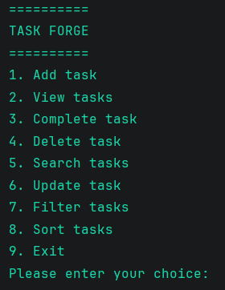
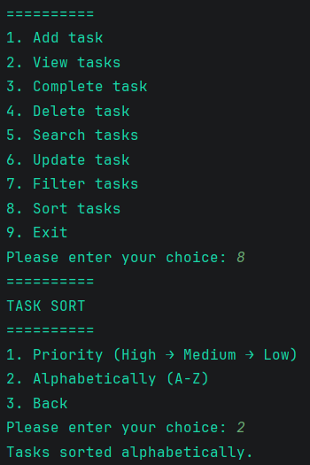

# 📋 Task Forge

Task Forge is a command-line task management application written in Python.

It allows users to create, update, complete, delete, search, filter, and sort tasks while automatically saving all data to a JSON file.

This project was built to practice object-oriented programming, file handling, and clean project structure.

This is my third Python portfolio project, created as part of my journey toward becoming a Python developer.


## ✨ Features

- Add new tasks
- View all tasks
- Mark tasks as completed
- Delete tasks
- Edit existing tasks
- Search tasks by title
- Filter completed and pending tasks
- Sort tasks by priority
- Sort tasks alphabetically
- Automatic JSON save/load
- Input validation

## 🛠 Technologies Used

- Python 3
- Object-Oriented Programming (OOP)
- JSON
- Git
- GitHub

## 📁 Project Structure

task-forge/
│
├── main.py
├── task.py
├── task_manager.py
├── save.py
├── menu.py
├── constants.py
├── tasks.json
└── README.md

## 🚀 Getting Started

Clone the repository:

```bash
git clone https://github.com/TheEzio5/task-forge.git
```

Go into the project folder:

```bash
cd task-forge
```


Run the application:

```bash
python main.py
```

## 📌 Future Improvements

- Due dates
- Categories
- Colored terminal output
- SQLite database
- Graphical User Interface (GUI)

## 📖 What I Learned

While building this project I practiced:

- Object-Oriented Programming
- Working with classes and objects
- File handling using JSON
- Error handling with try/except
- Code refactoring
- Writing reusable functions
- Using Git and meaningful commits

## 👤 Author

**Robert Banjad**

GitHub: https://github.com/TheEzio5


## 📸 Preview


